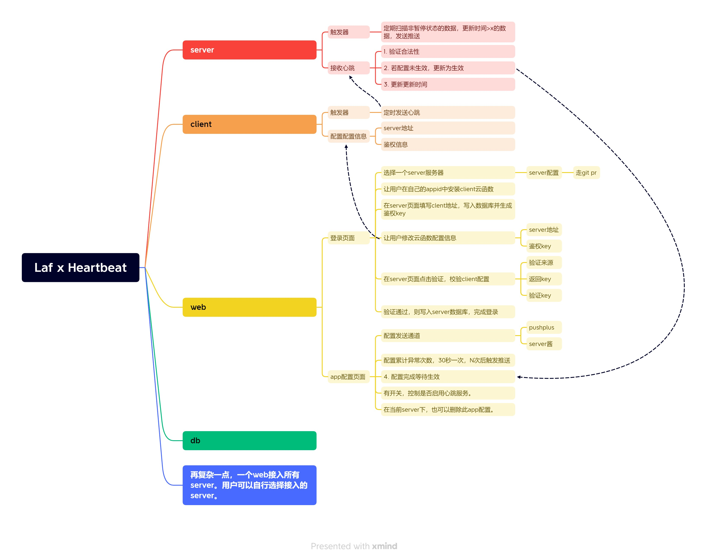

# laf_heartbeat

下面是立项时构思的大致逻辑, 实际有些许出入.

## client

作为客户端的云函数，主要就两个功能

1. 接收server发来的验证请求，返回设定好的key给server进行验证。
2. 发送心跳，去更新server中的数据信息。需要触发器指向这个方法。

## server

作为服务端的云函数，主要有以下功能

1. 注册 client
2. 激活 client
3. 切换 client 暂停状态
4. 删除 client
5. 更新 client 配置
6. 接收心跳，并处理数据。

## web（未实现）

无服务的web界面，主要有以下功能

1. 用户身份为客户端，选择一个 server，把自己的 client 注册到此 server，并做相关配置。
2. 用户身份为服务端，输入鉴权信息登录后，管理当前 server 下所有 client 数据。

