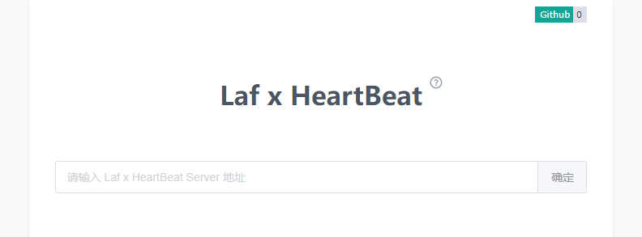
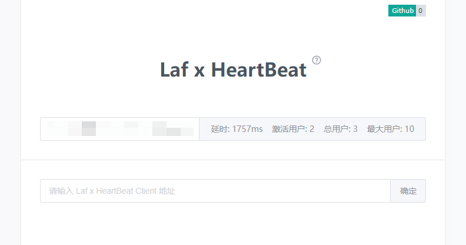
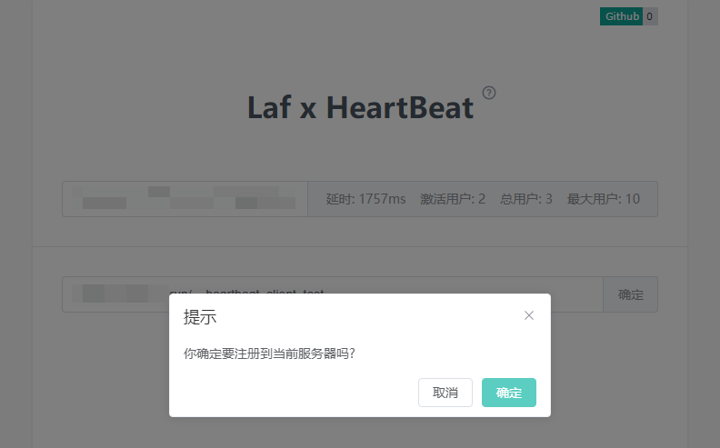
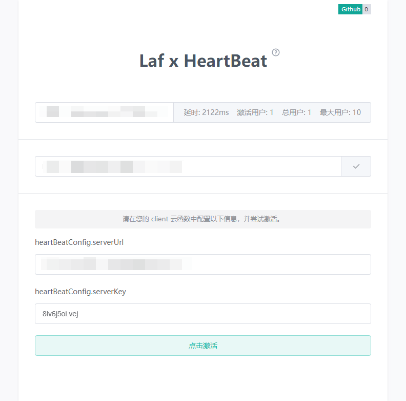
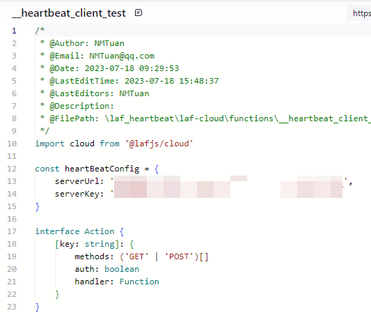
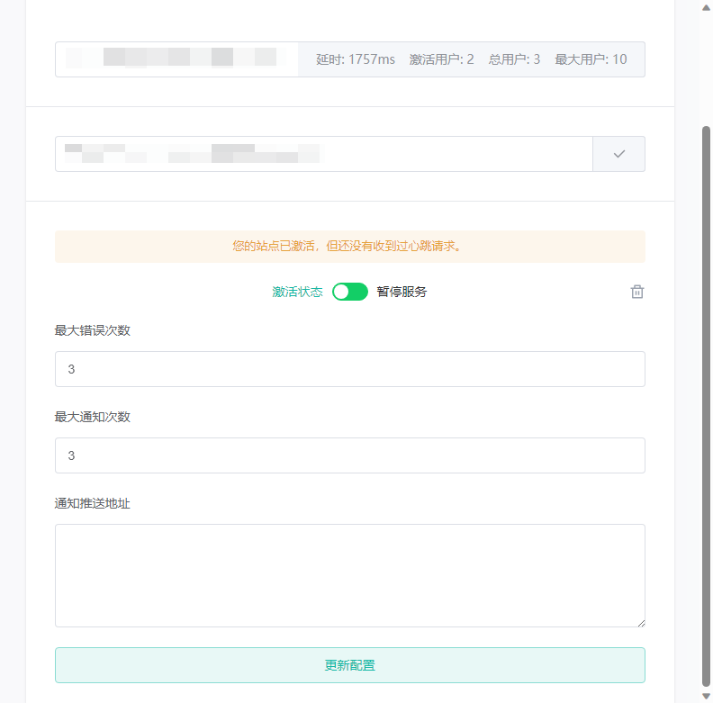
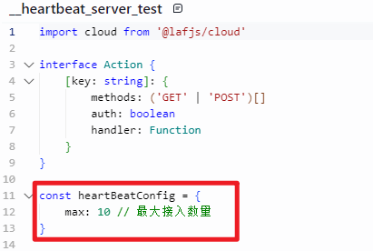

# laf_heartbeat

一个基于 Laf 的云函数心跳服务。


## 更新日志

[详见 release](https://github.com/NMTuan/laf_heartbeat/releases)


## 构成

本项目主要构成有3部分。

1. 心跳服务端云函数：`/laf-cloud/functions/__heartbeat_server_test.ts`
2. 心跳客户端云函数：`/laf-cloud/functions/__heartbeat_client_test.ts`
3. 供客户端注册、配置的web服务：除 `/laf-cloud/` 目录外其它文件。访问地址：[heartbeat.muyi.dev](https://heartbeat.muyi.dev/)


## 基本逻辑

1. client 注册到 server，并生成配置项。
2. 配置 client ，激活 client 在 server 的状态。
3. client 向 server 发送心跳，更新 server 中记录的更新时间，并重置异常次数和推送次数。
4. server 定期查询，并处理数据
    1. 更新时间比当前时间超 1 分钟，且异常次数超过最大设定值的，发起推送并计数，直到超过最大推送次数后不再发送。
    2. 更新时间比当前时间超 1 分钟，但异常次数未超过最大设定值的，异常次数+1.


## 客户端部署流程

> 前置条件：需要已知一个 Laf x HeartBeat server 地址。如果还没有，可以查看下面内容自己部署一个。

从 `Laf 函数市场` 或本项目 `/laf-cloud/functions/` 中找到 client 函数，部署至自己的 Laf 实例中。**注意：** 一定要把函数名改掉，随机的最好。尽量不要泄露你的 client 地址。

### 注册到心跳服务器

此流程基于web界面可视化操作，打开 [heartbeat.muyi.dev](https://heartbeat.muyi.dev/)，输入 server 地址，如下图。



如果 server 正常，则会显示服务基本信息，如下图。然后填写你的 client 地址。



未注册到当前服务器的 client 会出现以下提示，点击确定后即可注册到当前 server。



然后，页面会显示两个配置信息，需要你把配置信息填写到你的 client 云函数中，如下图。最后点击“激活”按钮。





激活后就可以看到如下配置界面，下次再登录也会显示该界面。



至此，注册和配置就完成了。还需要配置触发器，让心 跳起来。

### 配置触发器

> 还不了解 Laf 触发器，可以看[这里](https://doc.laf.run/guide/function/trigger.html)。

如果你当前 Laf 实例还未创建触发器，可以先为触发器创建一个云函数（内容在下面），然后创建触发器指向这个云函数即可；如果当前实例中已经有触发器了，可以参考下面的代码把 heartBeat 引入你的触发器函数。

```js
import { heartBeat } from '@/你 client 函数的名字'
exports.main = async function () {
    await heartBeat()
}
```

需要注意的是，服务端中配置的异常间隔是 1 分钟，所以触发器中配置的定时器，不要超过 1 分钟。


## 服务端部署流程

> server 和 client 不要部署在同一个 Laf 实例中，尽量也不要部署在一个 Laf 站点中。我不确定 laf.run (或 laf.dev) 内的实例是不是在一台物理服务器上，是否会出现整个 laf.run (或 laf.dev) 的实例一起停止。

从 `Laf 函数市场` 或本项目 `/laf-cloud/functions/` 中找到 server 函数，部署至自己的 Laf 实例中。最好把名字改一下，简单好记为准，方便分享。

> 如果你希望公开你的 server 服务，你可以[提交 server 信息至 issues](https://github.com/NMTuan/laf_heartbeat/issues)，我会把它展示到 web 端供大家使用。提 pr 就更好了，搓手期待！

为保证心跳服务不会影响到您实例中的实际业务，这里做了最大注册数的配置项，根据实际情况自行配置。



### 配置触发器

> 还不了解 Laf 触发器，可以看[这里](https://doc.laf.run/guide/function/trigger.html)。

如果你当前 Laf 实例还未创建触发器，可以先为触发器创建一个云函数（内容在下面），然后创建触发器指向这个云函数即可；如果当前实例中已经有触发器了，可以参考下面的代码把 heartBeat 引入你的触发器函数。

```js
import { schedule } from '@/你 server 函数的名字'
exports.main = async function () {
    await schedule()
}
```

需要注意的是，`schedule` 方法中配置的异常间隔是 1 分钟，所以触发器中配置的定时器，设置大于等于 1 分钟即可，推荐 1 分钟。


## 技术栈

* Laf 云函数
* nuxt.js v3
* pinia
* elementUI plus
* unocss

---------------------------

下面是立项时构思的大致逻辑, 实际有些许出入.


## client

作为客户端的云函数，主要就两个功能

1. 接收server发来的验证请求，返回设定好的key给server进行验证。
2. 发送心跳，去更新server中的数据信息。需要触发器指向这个方法。

## server

作为服务端的云函数，主要有以下功能

1. 获取 client
2. 注册 client
3. 激活 client
4. 切换 client 暂停状态
5. 删除 client
6. 更新 client 配置
7. 接收心跳，并更新数据。
8. 定时处理异常数据，需要触发器指向这个方法。
9. 获取服务器数据

## web

无服务的web界面，主要有以下功能

1. 用户身份为客户端，选择一个 server，把自己的 client 注册到此 server，并做相关配置。
2. <del>用户身份为服务端，输入鉴权信息登录后，管理当前 server 下所有 client 数据。</del>

